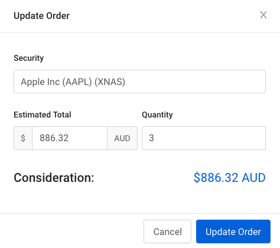

# Spitfire coding test

Implement a simplified version of our trading interface:

Your implementation should be a react app with code available on github and runnable online somewhere. Beyond that, choice of tools and frameworks is entirely up to you.

## Basic requirements
 
* Security: An auto complete field. As the user types, a dropdown displays matching instruments from the instruments api.

* Estimated total / Quantity: The user may enter either a total price or a number of units. When either input is changed by the user, the other will update to the appropriate value based on the price of the instrument.

* Consideration: Display the actual price of the order, including brokerage, which is available from the brokerage api. Note that brokerage is sometimes a flat rate and sometimes a percentage, and the details of that calculation are not available to the front end.

The submit buttons don't have to do anything.

# Additional requirement 

Add an option to make the estimated total inclusive of brokerage. 

In the initial implementation, entering $10,000 may result in ordering 100 units at $100, for a total consideration of $10,025 including brokerage. 

The inclusive version should subtract the brokerage when calculating the number of units, so would instead return 99 units for a total of $9,925

## API Example

    https://p6eq7oeqxl.execute-api.us-west-2.amazonaws.com/test/instruments?q=fund

    [
        {
            "id": "FUND1",
            "name": "First Fund",
            "price": 100,
        }
    ]

    https://p6eq7oeqxl.execute-api.us-west-2.amazonaws.com/test/brokerage?fundId=FUND1&units=100`
    {
        "fundId": "FUND1",
        "units": "100",
        "basePrice": 10000,
        "brokerage": 25,
        "totalPrice": 10025
    }
